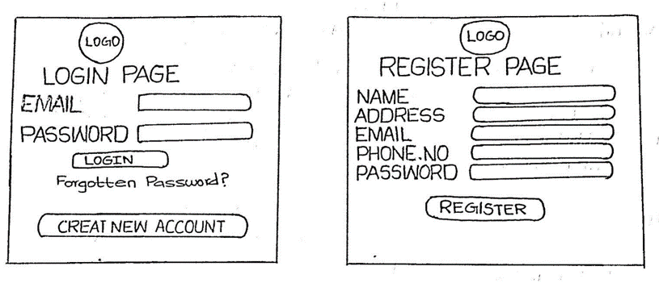
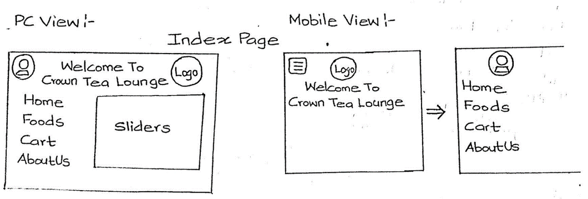
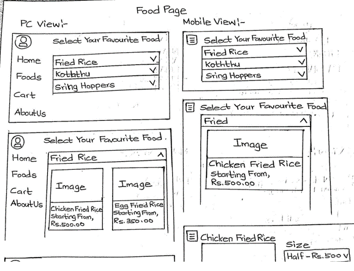
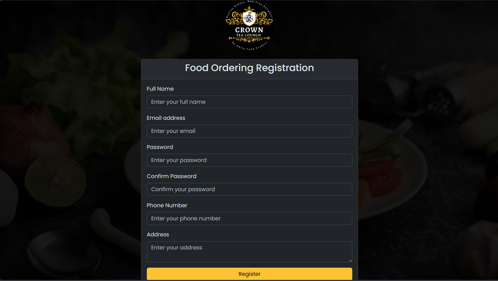
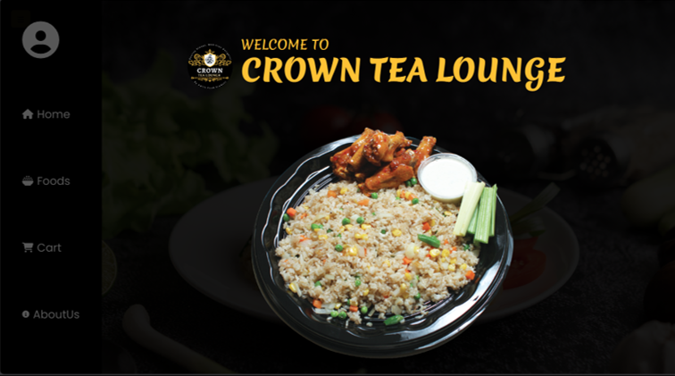
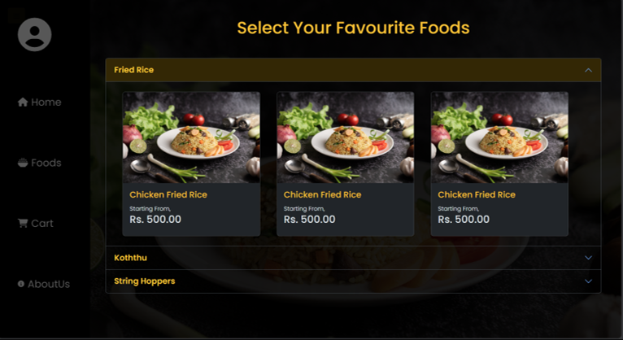
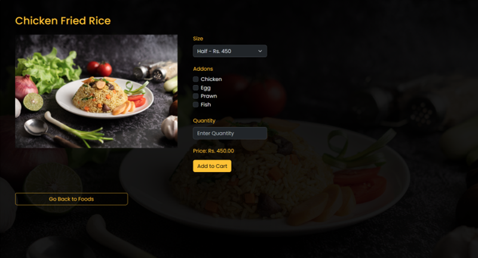
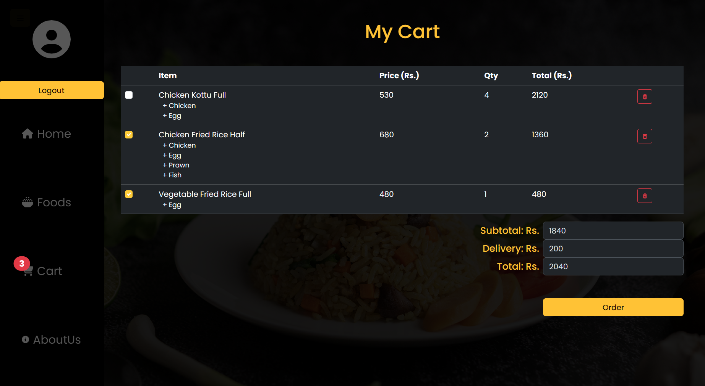
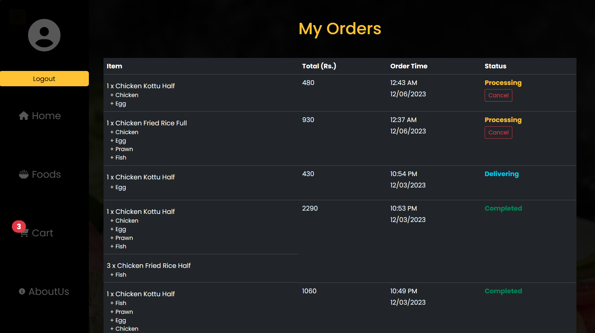

# Crown Tea Lounge Food Ordering System 🍽️🌐

## Challenge 🚧
Navigating Ratnapura's lively streets posed a hurdle for food enthusiasts. The demand for a convenient food ordering system was evident.

## Solution 🌟
We have developed a user-friendly web application for Crown Tea Lounge to address this challenge. This system facilitates seamless online ordering, connecting residents with our diverse menu, and enhances accessibility, providing a hassle-free dining experience for locals.

### Features 🛠️
- Browse Menu 📜
- Customize Orders 🎨
- Seamless Online Ordering 📲
- Hassle-free Payment on Delivery 💵

### How to Use 🤔
1. Browse the menu to explore our offerings.
2. Customize your order according to your preferences.
3. Place your order seamlessly through the user-friendly interface.
4. Enjoy a hassle-free dining experience with payment on delivery.

## Interfaces and Wireframes 🎨

Feel free to contribute and improve this food ordering system. Your feedback is valuable! 🙌
